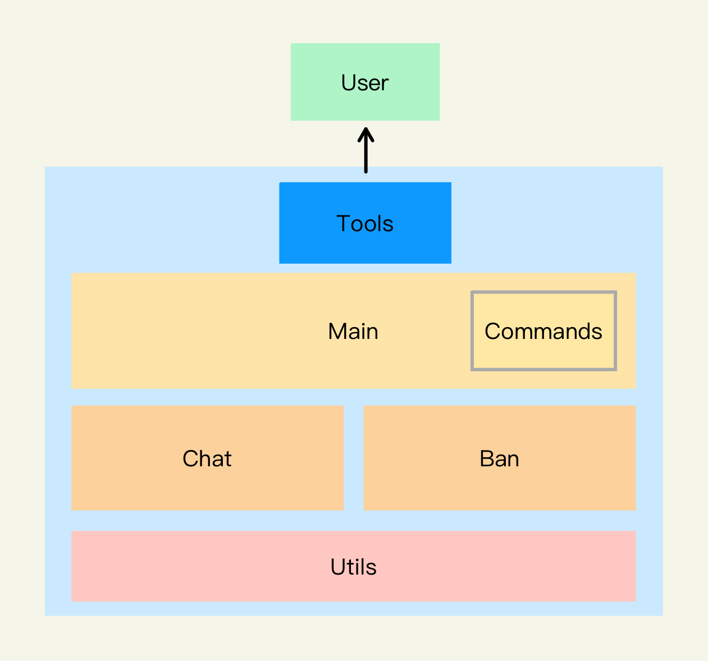

# 模型对话插件
## 简介
基于 Ncatbot + Langchain 的大模型对话插件，支持MCP服务器，可以进行持续对话，支持本地大模型加载、远程大模型调用，拥有图像识别功能，同时为大模型添加了短期记忆功能，针对每个 QQ 号拥有记忆能力。

- 支持所有 OpenAI 接口的通用**本地模型**，如 [ollama](https://ollama.com/)
- 支持所有 OpenAI 接口兼容的**远程模型**，包含 ChatGPT、Moonshot、Qwen、Deepseek 等
- 图像识别大模型需要调用支持图像识别的模型，可以分开调用 图像识别 和 文本对话 的API
- 支持标准化 MCP 服务器，如 [12306-mcp
](https://www.modelscope.cn/mcp/servers/@Joooook/12306-mcp)，但建议不要过多使用，使用 MCP 功能会多次调用 API，TOKENS 消耗速度略快

## 注意：
当前正在 main 分支进行 WebUI 开发，如果要下载插件请前往 [release](https://github.com/ouyangyanhuo/ModelChat/releases) 下载
## 开始使用

使用 `聊天菜单` 指令，可以获取所有指令，当配置为 Nacatbot 管理员时，会被认为是超级管理。

管理员、超级管理员会自动加载其专属的指令项目

注意：使用持续会话时会拒绝该用户除结束指令外的所有指令请求

## 系统架构

## 使用配置
-  安装依赖

```
pip install -r requirements.txt
```

- 配置文件

  - 将 `config.yml.template` 重命名为 `config.yml`，并且修改配置文件
  - 将 `mcp_config.json.template` 重命名为 `mcp_config.json`，并且修改配置文件

## 注意事项

- 解压文件夹名称必须为 ModelChat

- 用户若要使用本地大模型，请先确保本地模型系统的配置正确

- 模型的记忆文件位于插件目录 `/cache/history.json`，没有该文件会自动生成

- 模型图像识别方式：user input photo -> vision model -> text -> chat model -> output, 因此需要调用两次 API，无论是本地大模型还是云端大模型都是如此

目录结构如下：
```
ModelChat/
├── cache/
│   └── history.json    -- 聊天记录
├── __init__.py         -- 插件入口
├── ban.py              -- 违禁词管理系统
├── chat.py             -- 聊天核心
├── main.py             -- 插件主程序
├── utils.py            -- 插件工具类
├── commands.py         -- 指令管理
├── config.yml          -- 配置文件
├── data.json           -- 插件数据文件
└── mcp_config.json     -- MCP 配置文件
```

## 作者
[Magneto](https://fmcf.cc)

## 更新日志
- 2.3.0
  - 新增 配置动态加载（以适配 WebUI)
  - 修复 历史记录缓存 Bug
  - 新增 WebUI 功能，可以进行聊天对话
- 2.2.0
  - 新增 导出数据&配置文件功能（高危行为，仅超级管理员可用，并需在启动时修改配置文件）
- 2.1.0
  - 重构 系统架构
  - 优化 部分WARNING
  - 修改 指令注册模式
  - 删减 部分冗余代码
  - 新增 即时修改提示词
  - 优化 Ban 系统的逻辑
  - 新增 管理员菜单（若为管理员会自动加载）
  - 新增 违禁词添加、删除及其热重载（仅超级管理员可用）
  - 新增 管理员添加、删除及其热重载（仅超级管理员可用）
- 2.0.0
  - 修复多项错误
  - 重构了核心逻辑
  - 添加 MCP 功能
  - 使用 Langchain 语义系统优化代码
- 1.9.0
  - 优化 代码构成
  - 修复 图像历史记录无法被存储的 Bug 
- 1.8.1
  - 优化了视觉模型处理流程
- 1.8.0
  - 简化模型配置，删除 Ollama 依赖，改为使用通用 OpenAI 接口
- 1.7.0
  - 修复 无法即时重载 Ban List 的 Bug
  - 新增 指令添加违禁词
  - 新增 banlist.json 文件自动创建
  - 新增 超级管理员检测（使用 Ncatbot 接口，即检测 Ncatbot 配置下的管理员）
- 1.6.0
  - 添加持续对话功能
  - 优化代码构成
- 1.5.0
  - 优化代码构成
  - 本地模型支持图像识别（需对接云端接口）
- 1.4.0
  - 重写命令注册范式
  - 新增菜单系统
- 1.3.0
  - 增加 Ban user & Ban group
  - 修改违禁词存储结构
- 1.2.0
  - 违禁词检测
  - Markdown 格式符号清理
- 1.1.0
  - 图像识别
  - 清除记忆指令
  - requirements.txt
- 1.0.0
  - 本地大模型
  - 云端大模型
  - 多模型切换
  - 大模型记忆
## 许可证
GNU GENERAL PUBLIC LICENSE 3.0